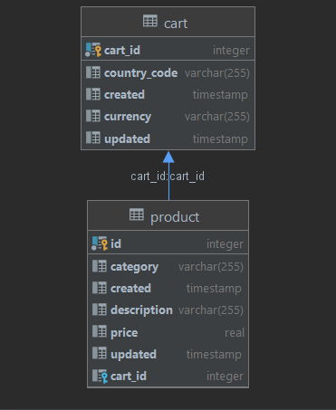

# shoppingCart

I have developed Based on 3 layer: Controller, Service and Dao(Repository).
Into data model I have 2 table (cart , product) these have one-to-many relationship.
Into service layer I have written business the shopping cart project such as validation, call repository and so on.
Into Controller layer I have written 5 Rest Api  
I use [postgres] db for real action 
I use [h2] db for test case (unit test, integration test)

### DataModel

## How to Run
* Execute tests:

  **mvn clean install**

* starting Application:

  **docker-compose up**

you can call five Rest Api for shopping Cart :

* [Firstly, you should call create a shopping cart]
  * [Create a shopping cart](http://localhost:8080/api/carts)
  
* [Secondly, if you want to have a product into shopping cart you should call add a product]
  * [Add a product to the shopping cart](http://localhost:8080/api/carts/1/products)
  
* [If you want to get the shopping cart]
  * [Get the shopping cart](http://localhost:8080/api/carts?cartId=1)

* [If you want to get a product in the shopping cart]
  * [Get a product in the shopping cart](http://localhost:8080/api/carts/1/products?productId=1)

* [If you want to delete a product from the cart]
  * [Delete a product from the cart](http://localhost:8080/api/carts/1/products?productId=1)

### Tools & Technologies

* [Java 8]
* [Spring boot]
* [Maven]
* [Docker]
* [Lombok]
* [Postgres]
* [Swagger]
* [JUnit 5]
* [Mockito]
* [H2]

### Guides
Follow the link below to find the proper documentation:
* [API Swagger UI](http://localhost:8080/swagger-ui.html#/)

### Author
This project has been implemented by **Abbas Payami** for Atlavik Code Challenge
[Contact me](payami2013@gmail.com)